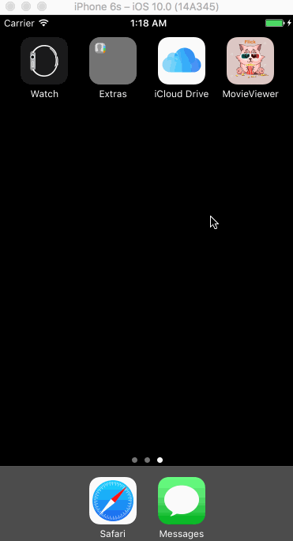

# Week1_Flicks
Codepath Week1 Assignment

**MovieViewer** is an app showing now-playing and top-rated movies. [The Movie Database API](http://docs.themoviedb.apiary.io/#) is used.  
This App was written with Xcode 8 and Swift 3.     
This is my App Icon:  
  

Submitted by: **Sally Zhang**

Time spent: **7.5** hours spent in total

## User Stories

The following **required** functionality is complete:  

* [x] User can view a list of movies currently showing in theaters.  
* [x] User can view movie details by tapping on a cell. 
* [x] User sees loading state while waiting for movies API. 
* [x] User sees an error message when there's a networking error.
* [x] User can pull to refresh the movie list.

The following **optional** features are implemented:  

* [x] Add a tab bar for Now Playing or Top Rated movies.  
* [ ] Implement a UISegmentedControl to switch between a list view and a grid view.  
* [ ] Add a search bar.  
* [ ] All images fade in as they are loading.  
* [ ] For the large poster, load the low-res image first and switch to high-res when complete.  
* [x] Customize the highlight and selection effect of the cell.  
* [x] Customize the navigation bar.  

Additional features are implemented:  

* [x] Use Cocoapods.  
* [x] Asynchronous image downloading implemented using the UIImageView category in the AFNetworking library.  
* [x] Request time out in 10 seconds. 

## Video Walkthrough 

Here's a walkthrough of implemented user stories:  
   

When there is a network issue (e.g. no WIFI), a "Network Error" message will be shown. And after the user connects with the internet again and does a refresh, all contents will be loaded and the error message will disappear.   

GIF created with [LiceCap](http://www.cockos.com/licecap/).

## Notes  
Would like to work on the unfinished optional and additional features in the near future.  

## License

    Copyright [2016] [Sally Zhang]

    Licensed under the Apache License, Version 2.0 (the "License");
    you may not use this file except in compliance with the License.
    You may obtain a copy of the License at

        http://www.apache.org/licenses/LICENSE-2.0

    Unless required by applicable law or agreed to in writing, software
    distributed under the License is distributed on an "AS IS" BASIS,
    WITHOUT WARRANTIES OR CONDITIONS OF ANY KIND, either express or implied.
    See the License for the specific language governing permissions and
    limitations under the License.
